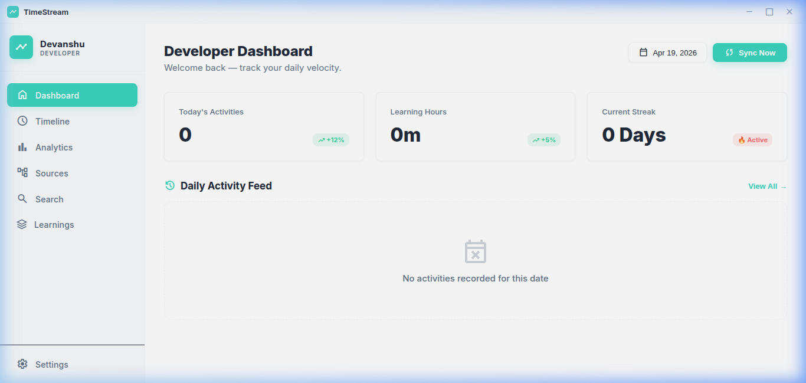
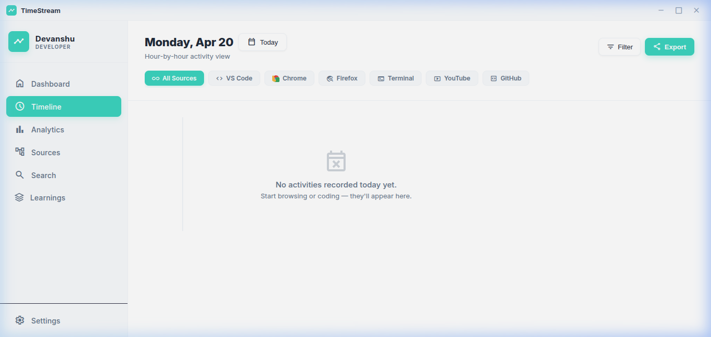
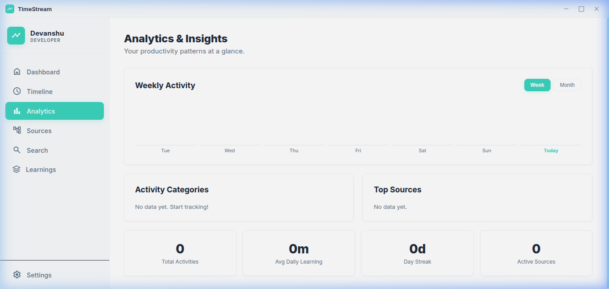
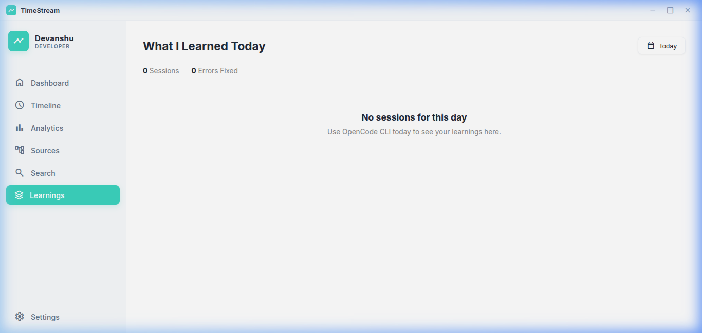
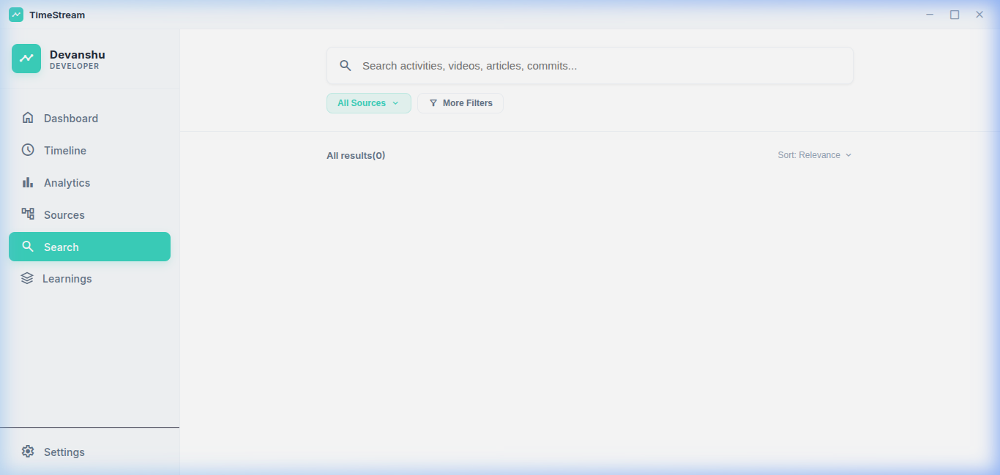
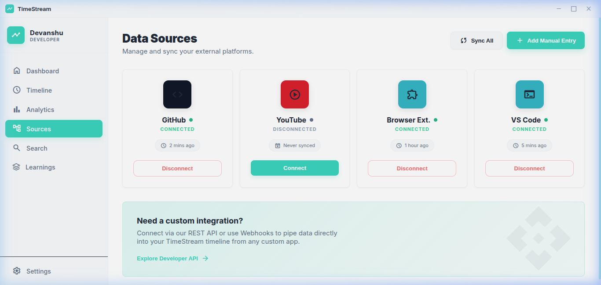

<div align="center">

<br/>


<h3>Your coding life, automatically recorded.</h3>

<p>An open-source desktop app that silently tracks everything you learn and build — <br/>then turns it into a beautiful daily insights dashboard.</p>

[](https://electronjs.org)
[](#)
[](#)
[](#)
[](#)

<br/>

---

### 🏆 *"The developer who reflects grows fastest."*

---

</div>

<br/>

## 🤔 The Problem

You code for hours. You watch tutorials. You chat with AI. You browse GitHub.

**But at the end of the week — can you actually remember what you did?**

Most developers have zero visibility into their own habits. You can't improve what you can't measure.

<br/>

## 💡 The Solution

**TimeStream** runs silently in your system tray and automatically logs every meaningful developer activity — no manual input, no timers, no friction.

Just open your laptop and your day gets recorded.

<br/>

---

## ✨ What TimeStream Tracks

<table>
<tr>
<td width="50%">

### 🌐 Browser Activity
Every meaningful tab you open.

| Source | What's Captured |
|--------|----------------|
| 🎬 **YouTube** | Educational videos (smart AI filter) |
| 🐙 **GitHub** | Repos, PRs, issues, commits |
| 🤖 **ChatGPT** | Your conversation topics |
| 🧠 **Claude AI** | Your AI prompts & sessions |
| 🔍 **Perplexity** | Research queries |
| 💬 **Reddit** | Tech & programming posts |

</td>
<td width="50%">

### 💻 Local Dev Activity
What you're building, automatically.

| Source | What's Captured |
|--------|----------------|
| ⚡ **OpenCode** | Coding sessions + duration |
| 🤖 **Claude CLI** | Agent conversations |
| 📊 **Learning time** | Exact minutes spent learning |
| 🔥 **Daily streaks** | Consecutive active days |
| 📈 **Weekly patterns** | Your peak productivity hours |

</td>
</tr>
</table>

<br/>

---

## 🎯 Core Features

<br/>

**📊 Analytics Dashboard**
> See your weekly and monthly activity bar chart. Find out which category consumes most of your time — Coding, Learning, Research, or DevOps. All from real data, zero guesswork.

<br/>

**🕐 Timeline View**
> A chronological feed of everything you did, hour by hour. Filter by category. Click any card to re-open the source. Think of it as your personal developer logbook.

<br/>

**🧠 AI Session Learnings**
> TimeStream imports your OpenCode and Claude CLI sessions — including project context, conversation summaries, and session duration — into a dedicated **Learnings** view.

<br/>

**🔎 Powerful Search**
> Instantly search across your entire history. *"What was that react tutorial I watched last week?"* — found in milliseconds.

<br/>

**🔒 100% Private**
> All data lives on your machine. There is no server. No cloud. No tracking. No accounts. TimeStream can never see your data.

<br/>

---

## 🧠 How Smart is the YouTube Filter?

Most tracking apps log *everything*. TimeStream is smarter.

It uses a **multi-signal scoring algorithm** to decide if a YouTube video is actually educational before logging it:

```
📌 Strong learning keyword in title  ("tutorial", "how to", "explained")  → +4 pts
🏷️  Tech keyword in title             ("React", "Docker", "Python"...)      → +1.5 pts each
🎓 Known educational channel         (Fireship, FreeCodeCamp, NeetCode...) → +4 pts
📝 Educational cues in description  ("source code", "follow along"...)     → +0.5 pts each
#️⃣  Tech hashtags in description                                            → +0.5 pts each

Score ≥ 3  →  ✅ Logged as "Learning"
Score < 3  →  ❌ Silently ignored
```

*"Top 10 Minecraft Moments"* — **ignored**.
*"Building a REST API with Node.js — Full Tutorial"* — **logged** ✅

<br/>

---

## 🖼️ App Gallery

<table>
  <tr>
    <td width="50%">
      <b>Dashboard</b><br/>
      
    </td>
    <td width="50%">
      <b>Timeline</b><br/>
      
    </td>
  </tr>
  <tr>
    <td width="50%">
      <b>Analytics</b><br/>
      
    </td>
    <td width="50%">
      <b>Learnings (AI Sessions)</b><br/>
      
    </td>
  </tr>
  <tr>
    <td width="50%">
      <b>Search</b><br/>
      
    </td>
    <td width="50%">
      <b>Sources</b><br/>
      
    </td>
  </tr>
</table>

<br/>

---

## 🚀 Get Started in 5 Minutes

### Prerequisites
- **OS:** Linux (Ubuntu 20.04+ / Debian-based recommended)
- **Node.js:** v18 or higher
- **npm:** v8 or higher
- **Build tools:** `sudo apt install build-essential` (required for native modules)

### Step 1 — Clone & Install

```bash
git clone https://github.com/devanshupatil/TimeStream.git
cd TimeStream
npm install && npx @electron/rebuild
```

### Step 2 — Run the App

```bash
npm run dev
```

### Step 3 — Install the Browser Extension

**Chrome:** `chrome://extensions` → Enable Developer Mode → **Load Unpacked** → select `chrome-extension/`

**Firefox:** `about:debugging` → This Firefox → **Load Temporary Add-on** → select `firefox-extension/manifest.json`

### Step 4 — Browse Normally
TimeStream is now active. Open GitHub, watch a tutorial, chat with AI — your timeline will populate automatically.

<br/>

---

## 🏗️ How It Works

```
┌─────────────────────────────────────────────────────────────┐
│                    YOUR BROWSER                              │
│  Chrome / Firefox Extension silently watches your tabs      │
│  ▸ Detects GitHub, YouTube, Reddit, AI tools               │
│  ▸ Applies smart filters (3-min rule + content scoring)    │
└────────────────────────┬────────────────────────────────────┘
                         │ POST localhost:3000/api/activity
                         ▼
┌─────────────────────────────────────────────────────────────┐
│                  TIMESTREAM DESKTOP APP                      │
│  Electron main process receives and deduplicates events     │
│  ▸ Persists to local JSON (activities.json)                │
│  ▸ Watches OpenCode SQLite + Claude CLI log files          │
│  ▸ Sends live updates to the renderer via IPC              │
└────────────────────────┬────────────────────────────────────┘
                         │
                         ▼
┌─────────────────────────────────────────────────────────────┐
│                    YOUR DASHBOARD                            │
│  Beautiful UI with Timeline · Analytics · Search · Learnings│
└─────────────────────────────────────────────────────────────┘
```

<br/>

---

## 🛠️ Tech Stack

| Layer | Technology | Why |
|-------|-----------|-----|
| Desktop | **Electron 41** | Linux-first native app |
| Extension | **Manifest V3** (Chrome + Firefox) | Secure, modern extension API |
| File Watching | **chokidar 5** | Reliable cross-platform FS events |
| Local DB | **better-sqlite3** | Fast, zero-config embedded SQL |
| Frontend | **Vanilla JS + Tailwind** | Zero build step, fast iteration |
| Packaging | **electron-builder** | AppImage + .deb for Linux |

<br/>

---

## ⚙️ CI/CD Pipeline

TimeStream uses **GitHub Actions** for automated testing, building, and releasing.

| Workflow | Trigger | What it does |
|----------|---------|--------------|
| **Continuous Integration** | Every push / PR to `main` | Validates manifests, packages extensions, uploads build artifacts |
| **Release** | Push a version tag (e.g. `v1.2.0`) | Builds Chrome extension zip + creates a GitHub Release automatically |

```
Push to main
     │
     ▼
┌─────────────────────────────┐
│  CI Workflow                │
│  ✔ Install dependencies     │
│  ✔ Validate manifests (jq)  │
│  ✔ Package Chrome extension │
│  ✔ Package Firefox extension│
│  ✔ Upload build artifacts   │
└─────────────────────────────┘

Push tag v*
     │
     ▼
┌─────────────────────────────┐
│  Release Workflow           │
│  ✔ Build extension zip      │
│  ✔ Create GitHub Release    │
│  ✔ Attach extension files   │
│  ✔ Auto-generate changelog  │
└─────────────────────────────┘
```

[](https://github.com/devanshupatil/TimeStream/actions/workflows/ci.yml)
[](https://github.com/devanshupatil/TimeStream/actions/workflows/release.yml)

<br/>

---

## 📦 Build for Distribution

```bash
npm run build:appimage    # → AppImage (portable, no install needed)
npm run build:deb         # → Debian/Ubuntu .deb package
npm run build             # → Both
```

<br/>

---

## 🗺️ What's Coming Next

- [ ] 🗓️ **GitHub-style heatmap** — see your consistency at a glance
- [ ] 📁 **Project tagging** — group activities into projects
- [ ] 📤 **Weekly Markdown reports** — export your week to share or reflect
- [ ] 💻 **VS Code extension** — track files and features you touch
- [ ] 🍅 **Pomodoro integration** — link focus sessions to activities
- [ ] 🌍 **Multi-language support**

<br/>

---

## 📄 License

MIT License — free to use, modify, and distribute. See [LICENSE](LICENSE) for details.

<br/>

---

## 🤝 Contributing

TimeStream is open source and contributions are very welcome!

```bash
# Fork → Clone → Install → Build
git clone https://github.com/<you>/TimeStream.git
cd TimeStream && npm install && npm run dev
```

Open an issue first for big features. PRs for bug fixes are always welcome directly.

<br/>

---

<div align="center">

## 🌟 If this resonates with you — star the repo!

*Built by a developer, for developers.*
*Because the people who track their growth are the ones who keep growing.*

<br/>

**[⭐ Star on GitHub](https://github.com/devanshupatil/TimeStream)** · **[🐛 Report an Issue](https://github.com/devanshupatil/TimeStream/issues)** · **[💬 Start a Discussion](https://github.com/devanshupatil/TimeStream/discussions)**

<br/>

---

Made with ❤️ by **[Devanshu Patil](https://github.com/devanshupatil)**

</div>
