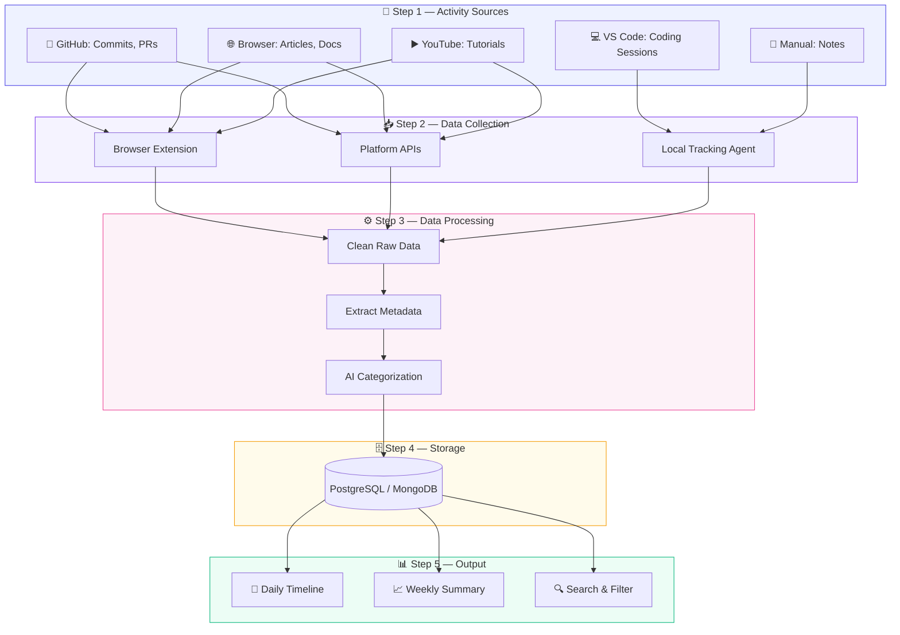
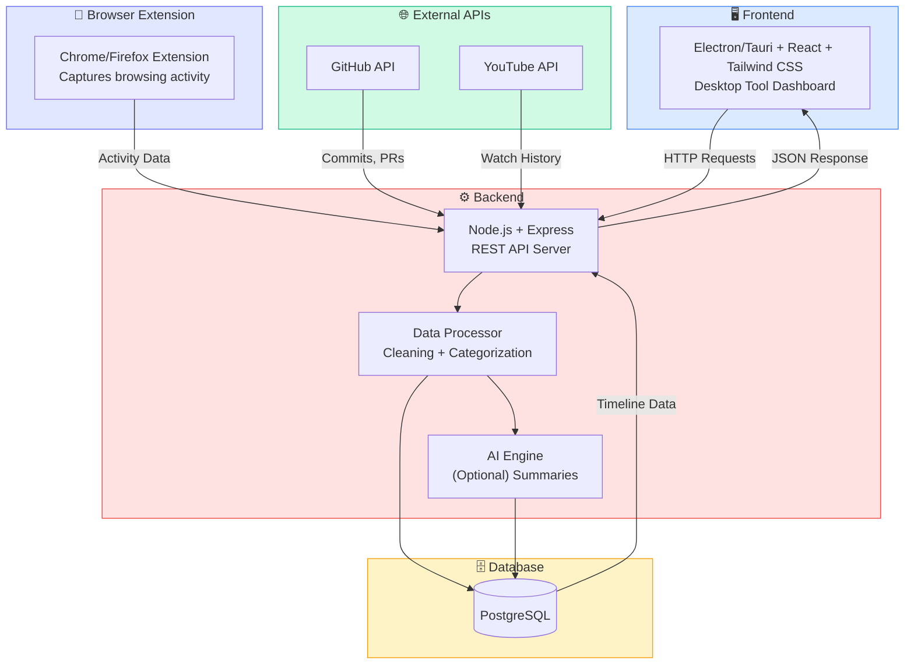
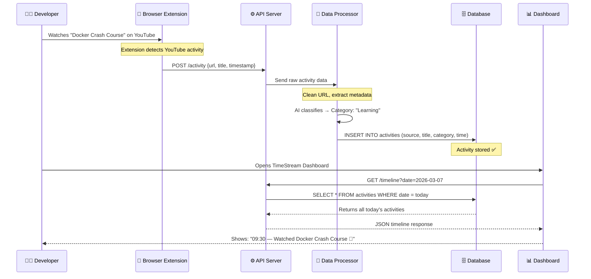

# TimeStream — Automatic Developer Activity Timeline

## Overview

**TimeStream** is a system that automatically records and organizes a developer’s daily learning and work activities into a searchable timeline.

Instead of manually writing daily notes, TimeStream automatically logs things like:

* GitHub commits and PR comments
* Articles or documentation you read
* YouTube videos you watch for learning
* Research papers you open
* Coding activity in your editor
* Links you explore while solving problems

The system collects this data from different platforms and turns it into a **daily activity timeline**.

The goal is to build a **personal knowledge history** — a record of everything you learn and build.

### 🔄 High-Level System Flow

---

# Problem

Developers and students learn many things every day but quickly forget where they learned them.

Example problems:

* You read a great article last week but cannot find it again.
* You learned a solution from a YouTube video but forgot the title.
* You worked on multiple GitHub issues but don't remember the details.
* Writing daily work logs manually takes time.

Because of this, most knowledge gets lost.

---

# Solution

TimeStream automatically collects your activities and builds a timeline.

Example timeline:

March 7

09:30 — Watched YouTube video: Docker Crash Course
10:20 — Read article: React Performance Optimization
11:10 — Commented on GitHub PR #24
13:30 — Viewed research paper on neural networks
15:00 — Worked on portfolio website

This gives you a **complete history of what you learned and built**.

---

# How It Works

The system works in four main stages.

### 📊 Complete Data Pipeline Diagram

## 1. Activity Collection

TimeStream collects activity data from different sources.

Sources can include:

GitHub
Browser activity
YouTube history
Coding editor activity
Research paper websites
Manual notes

Example activity data:

{
"source": "youtube",
"title": "Docker Tutorial for Beginners",
"url": "youtube.com/...",
"time": "2026-03-07T10:22"
}

This data is captured by:

* Browser extensions
* Platform APIs
* Local tracking agents

---

## 2. Data Processing

Raw data is cleaned and structured.

Example transformation:

Raw:

youtube.com/watch?v=abc123

Processed:

Platform: YouTube
Title: Docker Tutorial for Beginners
Category: Learning

AI can also classify activities:

Learning
Coding
Research
Communication

---

## 3. Database Storage

All activities are stored in a database.

Example structure:

Activities Table

id
user_id
source
title
url
timestamp
category

Database options:

PostgreSQL
MongoDB

---

## 4. Timeline Generation

Activities are grouped by date and sorted by time.

Example query:

SELECT * FROM activities
WHERE date = '2026-03-07'
ORDER BY timestamp;

Output becomes a **daily timeline**.

---

## 5. Dashboard

Users open the TimeStream dashboard to view their activity.

Features:

* Daily timeline
* Weekly summaries
* Search activity history
* Filter by platform
* Knowledge insights

Example dashboard view:

March 7

09:30 — Watched Docker tutorial
10:20 — Read React article
11:10 — GitHub PR comment
14:30 — Coding session in VS Code

---

# Architecture

**Example stack:**

| Layer           | Technology              |
|-----------------|-------------------------|
| **Frontend**    | Electron/Tauri + React + Tailwind CSS |
| **Backend**     | Node.js + Express       |
| **Database**    | PostgreSQL              |
| **Integrations**| GitHub API, YouTube API, Browser Extension |

---

# AI Features (Optional)

AI can improve the system by generating summaries.

Example:

Today you focused on:

* Docker learning
* React performance optimization
* GitHub code reviews

Weekly report example:

You watched 12 tutorials
You read 8 articles
You made 16 GitHub commits

---

# Why This Idea Is Powerful

## 1. Automatic Knowledge Tracking

It creates a history of what you learn without manual effort.

---

## 2. Developer Productivity Insights

You can see how you spend your time:

Coding
Learning
Research

---

## 3. Searchable Learning History

You can search past learning.

Example search:

docker

Results may include:

* Videos watched
* Articles read
* GitHub projects related to Docker

---

## 4. Useful for Students and Developers

This system helps:

Developers
Researchers
Students
Content creators

---

# Similar Tools

Some tools already exist that solve parts of this idea.

Examples include:

* RescueTime
* WakaTime
* ActivityWatch
* Rewind AI

However, most of these tools focus on **time tracking** instead of **knowledge tracking**.

TimeStream focuses on building a **learning timeline**.

---

# Future Features

Possible advanced features:

AI knowledge summaries

Weekly learning reports

Developer skill insights

Integration with documentation platforms

Voice notes and manual annotations

Smart recommendations based on activity

---

# 🔍 Real-World Task Walkthrough: How a Single Activity Flows

Let's trace what happens when you **watch a YouTube video**:

**Step-by-step breakdown:**

| Step | What Happens | Where |
|------|-------------|-------|
| 1 | Developer watches a YouTube tutorial | Browser |
| 2 | Browser extension captures the URL & title | Chrome Extension |
| 3 | Extension sends activity data to the API | API Server |
| 4 | Server processes, cleans, and categorizes the data | Data Processor |
| 5 | Processed activity is saved to the database | PostgreSQL |
| 6 | Developer opens the dashboard | Desktop Tool |
| 7 | Dashboard fetches today's timeline | API → DB |
| 8 | Activity appears on the daily timeline | Dashboard UI |

> 💡 **This entire flow happens automatically** — the developer just watches the video and it appears on their timeline!

---

# Example Use Case

A developer learning Docker might see:

Monday

Watched Docker beginner tutorial
Read Kubernetes documentation
Tested container deployment

Friday

Solved container networking issue
Read blog on Docker optimization

Over time this becomes a **complete learning history**.

---

# Project Value

TimeStream is a strong portfolio project because it includes:

Full stack development

API integrations

Browser extensions

Data processing

Dashboard UI

Optional AI features

It demonstrates real-world software engineering skills.

---

# Conclusion

TimeStream is a tool that automatically records a developer's learning and work activities and turns them into a structured timeline.

Instead of forgetting what you learned, you build a **personal knowledge history that grows every day**.
